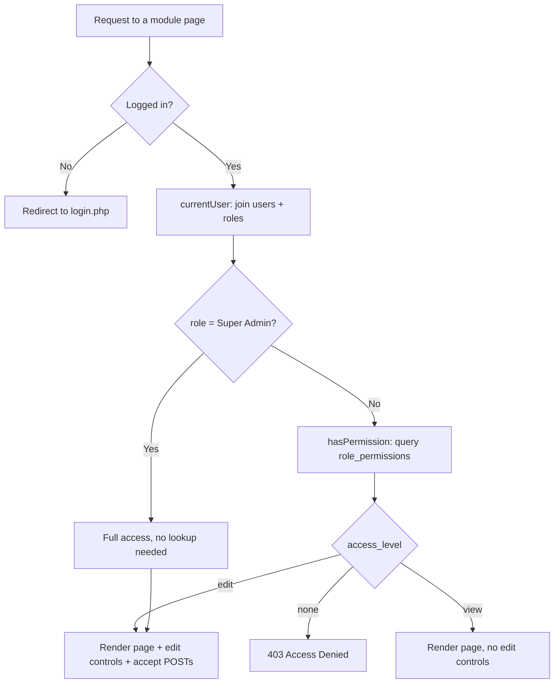
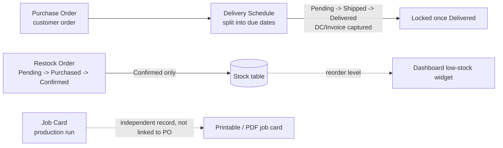

# Creative Printers — Business Management App

An internal web app for Creative Printers (a printing company) to manage customer purchase orders, delivery schedules, internal stock replenishment, and production job cards — with role-based access control and a full activity audit trail.

Plain PHP + MySQL, no framework, no build step. Deployed on shared hosting (Hostinger) via GitHub Actions.

## Use Cases

The app is used by five kinds of staff, each with a different day-to-day job. Access to every area is controlled by role — Super Admin decides who can just look at something ("View") versus who can actually change it ("Edit"), per area, per role.

| Role | What they typically do |
|---|---|
| **Super Admin** | Manages user accounts, creates/edits roles, and sets what every other role can see or do (Roles & Permissions page). Always has full access everywhere. |
| **Owner** | Full visibility and control across Stock, Purchase Orders, Delivery Schedule, Restock Orders, and Job Cards — the business-side "sees everything" role, without user/role administration. |
| **Accountant** | Read-only visibility into everything (by default) — POs, deliveries with DC/Invoice numbers, stock levels, restock spend — for reconciliation, without being able to change records. |
| **Sales** | Creates customer Purchase Orders, creates Job Cards for production, views Stock and Delivery Schedule to answer customer questions. |
| **Delivery** | Owns the Delivery Schedule — updates status (Pending → Shipped → Delivered), records DC Number / Invoice Number / DC Date / Bill Date once a delivery goes out. |

These are just the seeded defaults — Super Admin can rename what each role can do, or create entirely new roles, at any time from **Roles & Permissions**.

### End-to-end example: a customer order

1. **Sales** creates a Purchase Order (PO number, customer, one or more item codes/quantities).
2. **Delivery** splits that PO into one or more delivery due dates as batches ship.
3. As each batch goes out, **Delivery** marks it *Delivered* and records the DC Number, Invoice Number, DC date, and bill date — once marked Delivered, that entry locks and can't be edited again.
4. **Accountant** reviews the DC/Invoice trail for reconciliation without needing edit access to anything.
5. **Super Admin** or **Owner** can see the full picture on the Dashboard (overdue deliveries, low stock) and, if needed, look up exactly who did what and when in the **Activity Log**.

### End-to-end example: restocking inventory

1. Someone notices a product is low (visible on the Dashboard's "Low stock" widget, driven by each product's reorder level).
2. A Restock Order is created (product, quantity, supplier).
3. Once physically purchased, it's marked *Purchased*.
4. It's then *Confirmed* (with the actual received quantity, which may differ from what was ordered) — this is the only step that actually increases the Stock table.

## Features

- **Stock** — product inventory with reorder-level low-stock alerts
- **Purchase Orders** — customer orders, one PO number can cover multiple item codes, entered in a single multi-row form
- **Delivery Schedule** — one PO can have several delivery due dates; status tracking with DC/Invoice capture on delivery, locked once Delivered
- **Restock Orders** — internal purchasing workflow (Pending → Purchased → Confirmed) that feeds back into Stock
- **Job Cards** — digital version of the paper production form, with a print-formatted view sized to the company's job card stock and a client-side PDF download
- **Roles & Permissions** — Super Admin configures None/View/Edit per role per module; roles themselves can be created on the fly
- **Users** — Super Admin creates/edits/deletes accounts and assigns roles
- **Activity Log** — an audit trail of every create/update/delete/status-change action plus login/logout, with who, what, and when
- **Automatic email reminders** — a daily cron job emails Super Admins about deliveries due soon or overdue

## Architecture

**Stack:** Plain PHP (PDO + prepared statements), MySQL/MariaDB, Tailwind CSS via CDN, vanilla JS. No framework, no bundler — every page is a self-contained `.php` file that shares a handful of `includes/` helpers.

### System & deployment

```mermaid
flowchart LR
    subgraph Local["Local development"]
        Dev[Developer] -->|git push main| Repo[(GitHub repo)]
    end

    subgraph Actions["GitHub Actions"]
        Repo --> Workflow[deploy.yml]
    end

    subgraph Host["Hostinger shared hosting"]
        Workflow -->|FTP sync, excludes .sql/.md/.git| App[public_html/app/*.php]
        App --> PHP[PHP runtime]
        PHP --> DB[(MySQL database)]
        Creds["db_credentials.php\n(account root, outside public_html)"] -.loaded by db.php.-> PHP
        Cron[Daily cron job] --> Reminders[send_reminders.php]
        Reminders --> DB
    end

    Browser[Staff browser] -->|HTTPS login| PHP
```

Database migrations (`app/migrations/*.sql`) are deliberately excluded from the automated deploy — they're run manually once via phpMyAdmin, since they can alter live data and shouldn't fire unattended on every push.

Credentials are isolated outside the deployed tree entirely: `includes/db.php` (tracked in git, holds no secrets) loads real values from `db_credentials.php` living one level above `public_html` — a location no deploy or Git pull ever touches, so redeploying can't wipe out production credentials.

### Access control (RBAC)

Every module page starts with the same two-line gate, then optionally shows edit controls:

```php
requirePermission('deliveries', 'view');   // 403s anyone without at least View
$canEdit = hasPermission('deliveries', 'edit');  // gates POST handlers + edit UI
```



Permissions are read **fresh from the database on every request** — no session caching — so when Super Admin changes what a role can do, it takes effect immediately for anyone already logged in, no re-login required. There is no `admin/` vs `user/` folder split; every module is one file used by every role, differing only in which controls render.

### Business data flow



## Database

Core tables (see `app/schema.sql` for full definitions, `app/migrations/` for the incremental history):

- `roles`, `role_permissions` — the RBAC layer
- `users` — accounts, each with a `role_id`
- `stock` — inventory with reorder levels
- `purchase_orders` — customer orders (`UNIQUE(po_number, item_code)` allows one PO to span multiple items)
- `deliveries` — due dates against a PO, with DC/Invoice fields
- `restock_orders` — internal purchasing workflow
- `job_cards` — production records
- `activity_log` — audit trail; `username`/`role_name` are stored as snapshots so entries stay readable even after a user is deleted

## Project structure

```
app/
├── index.php              # Dashboard (universal landing page)
├── stock.php
├── purchase_orders.php
├── deliveries.php
├── restock_orders.php
├── job_cards.php
├── job_card_print.php     # printable/PDF job card view
├── users.php               # Super Admin only
├── roles.php                # Super Admin only — Roles & Permissions matrix
├── activity_log.php
├── change_password.php
├── login.php / logout.php / setup.php
├── send_reminders.php      # run via cron, not visited in a browser
├── includes/
│   ├── db.php / db_credentials.example.php
│   ├── auth.php             # requireLogin / requirePermission / requireSuperAdmin / hasPermission
│   ├── activity_log.php     # logActivity()
│   ├── flash.php            # post-redirect-get flash messages
│   ├── layout_start.php / layout_end.php  # shared chrome + permission-driven nav
│   ├── job_card_logic.php / job_card_content.php
│   └── tailwind_head.php
├── migrations/              # one file per schema change, run manually on the live DB
└── schema.sql                # full schema for a fresh install
```

## Local development

```bash
# from the repo root
php -S localhost:8080
mysql -u root -e "CREATE DATABASE creative_printers_dev"
mysql -u root creative_printers_dev < app/schema.sql
```

Then create `db_credentials.php` three directories above `app/includes/` (or point `db.php` at your local DB directly for dev) and visit `http://localhost:8080/app/setup.php` once to create the first Super Admin login.

## Deploying

Push to `main` — GitHub Actions FTP-syncs everything except `.sql`, `.md`, and `.git*` files to `public_html/` on Hostinger. After a schema change, run the corresponding new file in `app/migrations/` manually via phpMyAdmin (they're written to be safe on a live database with existing data).
